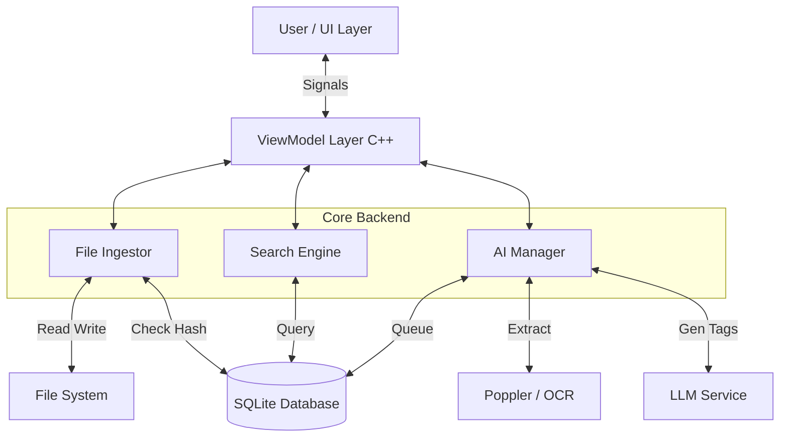
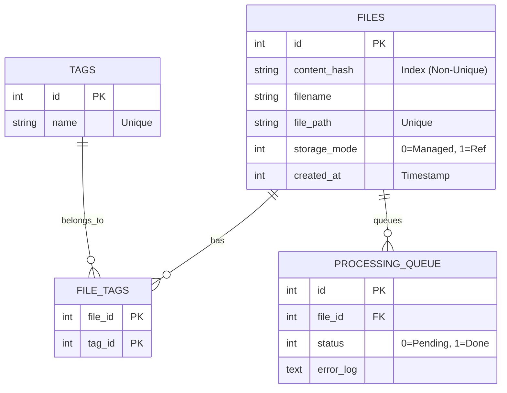
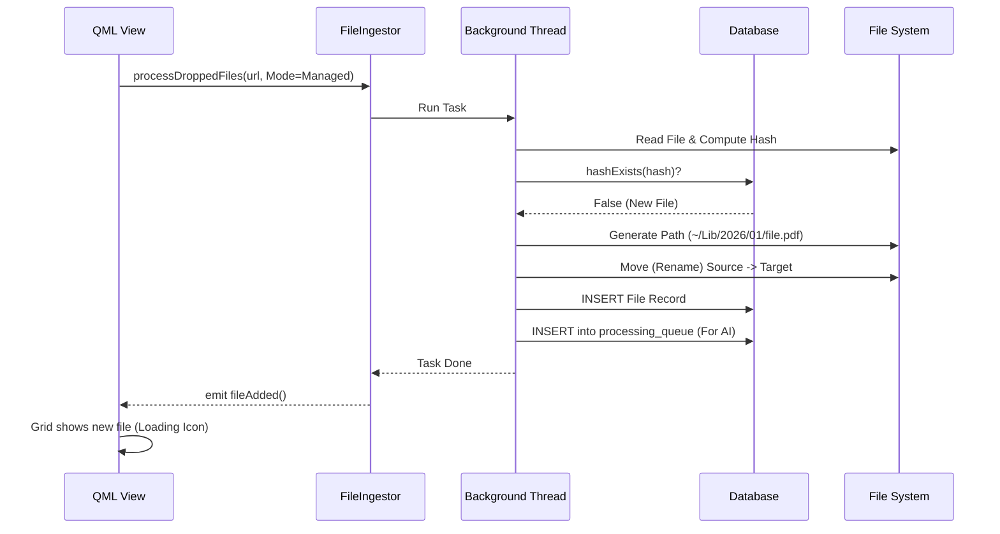
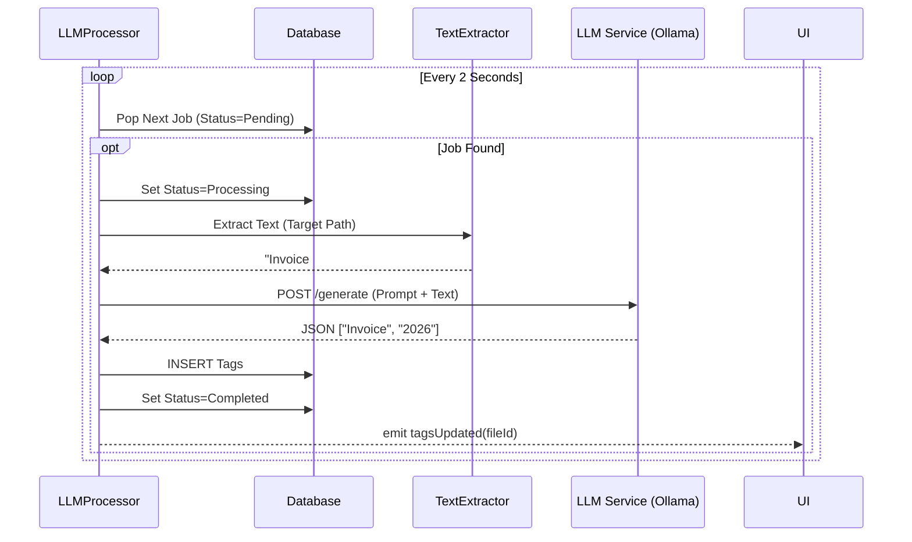

# Detailed Design Specification

**Project:** TagStore (TS-2026)

**Type:** Technical Implementation Guide

## 1. System Architecture

The backend is structured around an MVVM pattern with dedicated worker agents for I/O operations.

### 1.1 High-Level Block Diagram



## 2. Data Design (Schema)

The database uses a **"Flat Model"** optimization: Hashes are indexed but not unique (allowing physical copies), while file paths are unique.

### 2.1 Entity Relationship Diagram (ERD)



## 3. Class Design (C++)

### 3.1 `DatabaseManager` (Singleton)

Responsible for thread-safe SQLite access.

```cpp
class DatabaseManager : public QObject {
    Q_OBJECT
public:
    static DatabaseManager& instance();
    bool addFile(const FileDTO &file);
    bool hashExists(const QString &hash);
    QList<FileDTO> getFilesByHash(const QString &hash);
    
    // Dynamic SQL Generation for Faceted Search
    QSqlQueryModel* search(const QString &keyword, const QList<int> &tagIds);
    
    // Queue Management
    void pushToQueue(int fileId);
    int popNextQueueItem(); 
};

```

### 3.2 `FileIngestor` (Controller)

Orchestrates the ingestion logic and conflict resolution.

```cpp
class FileIngestor : public QObject {
    Q_OBJECT
public:
    enum ImportMode { Managed, Referenced };
    enum ConflictResolution { Reject, ImportAsCopy, MergeAlias };

    Q_INVOKABLE void processDroppedFiles(const QList<QUrl> &urls, ImportMode mode);
    Q_INVOKABLE void resolveConflict(QString jobId, ConflictResolution resolution);

signals:
    void conflictDetected(QString jobId, QString newName, QString existingPath);
    void fileAdded(); 
};

```

### 3.3 `LLMProcessor` (Worker Agent)

Handles background text extraction and LLM API calls.

```cpp
class LLMProcessor : public QObject {
    Q_OBJECT
public slots:
    void startLoop(); // Infinite loop checking processing_queue

private:
    void processItem(int fileId) {
        QString context = extractText(fileId); // via Poppler
        QStringList tags = m_llmProvider->generateTags(context);
        DatabaseManager::instance().addTags(fileId, tags, "AI_Generated");
    }
};

```

## 4. Workflow Sequence Diagrams

### 4.1 Ingestion Pipeline (Managed Mode)



### 4.2 AI Analysis Pipeline (Lazy Loading)



## 5. Implementation Roadmap

1. **Phase 1 (Skeleton):**
* Implement `LibraryConfig` (`~/Documents` path logic).
* Initialize SQLite Schema.
* Implement `FileHasher` and valid SHA-256 output.


2. **Phase 2 (Ingestion):**
* Implement `FileIngestor` (Move vs. Link).
* Implement the floating `DropBalloon` in QML.


3. **Phase 3 (Core UI):**
* Build `GridView` and `LibraryModel`.
* Implement Dynamic SQL for Faceted Search.


4. **Phase 4 (Intelligence):**
* Integrate Poppler (Text Extraction).
* Connect to local Ollama API.